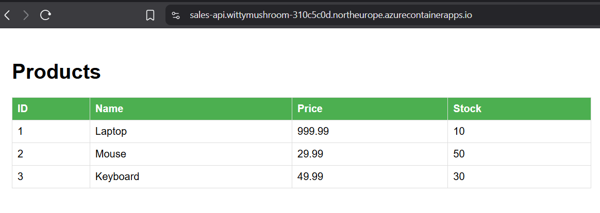
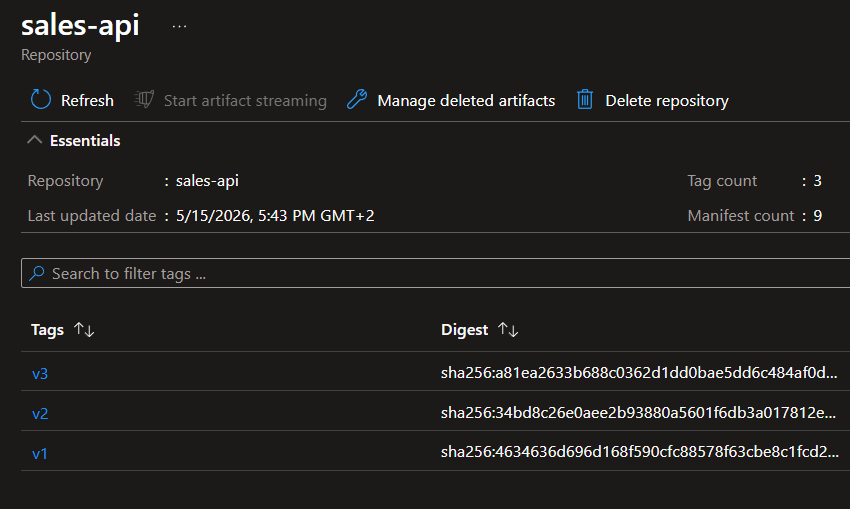
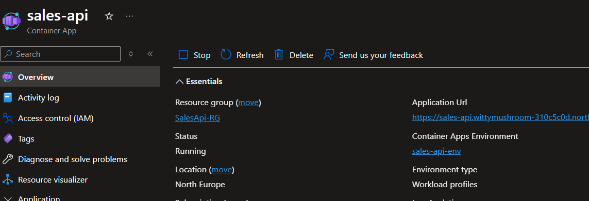
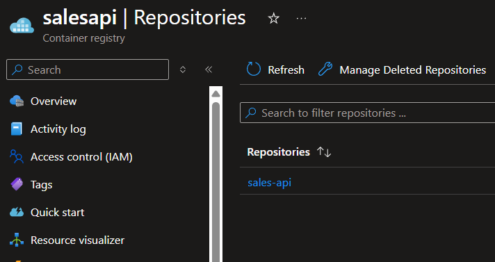
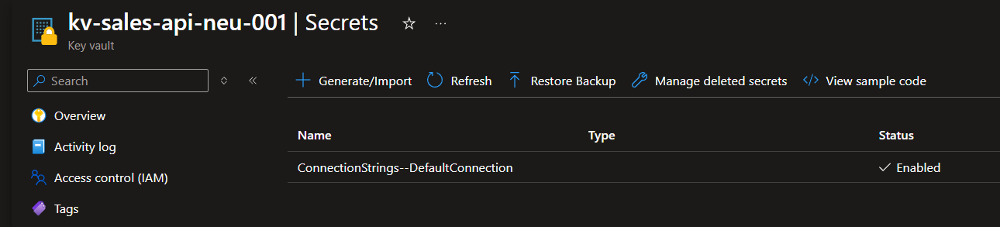
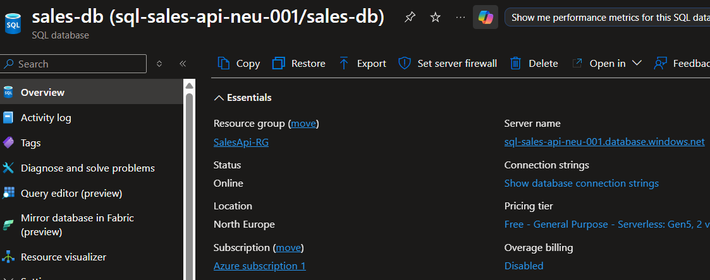

# Sales API

ASP.NET Core Web API deployed on Azure Container Apps with Azure SQL Database and Key Vault secrets management.

## Tech Stack
- .NET 10
- Docker
- Azure Container Registry
- Azure Container Apps
- Azure SQL Database
- Azure Key Vault
- Managed Identity

## Architecture

Local code → Docker image → Azure Container Registry → Azure Container Apps
                                                              ↓
                                                      Azure SQL Database
                                                      Azure Key Vault (connection string)

## Endpoints

| Method | Endpoint | Description |
|--------|----------|-------------|
| GET | /products | Get all products |
| GET | /products/{id} | Get product by ID |
| POST | /products | Create product |
| PUT | /products/{id} | Update product |
| DELETE | /products/{id} | Delete product |

## Deployment

Docker image is hosted on Azure Container Registry and deployed via Azure Container Apps. Connection string is stored in Azure Key Vault and accessed via Managed Identity — no credentials in code or config files.

## Screenshots

**Live App**

**Azure Container Registry**

**Container App Overview**

**Container Registry**

**Key Vault Secrets**

**Azure SQL Database**
